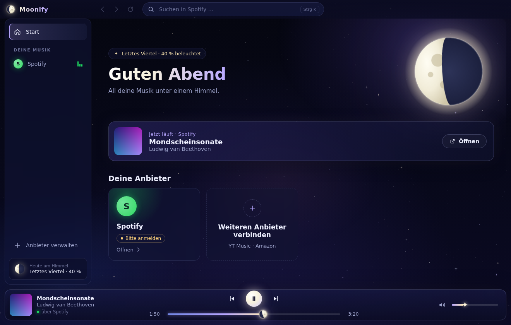

# 🌙 Moonify

**Spotify, YouTube Music und Amazon Music in einer App – unter einem Sternenhimmel.**

Moonify ist eine Desktop-App (Windows, macOS, Linux), mit der du Musik von deinen Diensten hörst,
ohne zwischen mehreren Apps oder Browser-Tabs zu wechseln.



## Funktionen

- **Ein Fenster für alles:** Spotify, YouTube Music und Amazon Music laufen direkt in Moonify.
- **Nichts ist Pflicht:** Verbinde einen, zwei oder alle drei Dienste. Seitenleiste, Startseite und
  Suche zeigen nur die Anbieter, die du verbunden hast. Nicht verbundene Dienste werden gar nicht geladen.
- **Eine Playerleiste für alle Dienste:** Titel, Künstler, Cover, Play/Pause, Vor/Zurück, Lautstärke –
  egal, bei welchem Anbieter gerade etwas läuft.
- **Mond-Fortschrittsleiste:** Der Regler ist ein Mond, der mit dem Song wächst – von der schmalen
  Sichel am Anfang bis zum Vollmond am Ende. Bedienbar per Maus (klicken/ziehen) und Tastatur (← →).
- **Nie zwei Songs gleichzeitig:** Startest du Musik bei einem Dienst, pausieren die anderen automatisch.
- **Eine Suche für alles:** Ein Suchfeld (`Strg/⌘ + K`) sucht in all deinen verbundenen Diensten;
  über Tabs wechselst du zwischen den Ergebnissen. Läuft gerade Musik, wird sie dabei nicht unterbrochen.
- **Sternenhimmel-Theme:** Animierte, funkelnde Sterne, Sternschnuppen, Nebel in Violett und Blau,
  Glas-Oberflächen und die **echte Mondphase von heute** auf der Startseite.
- **Getrennte Logins:** Jeder Dienst hat eine eigene, gespeicherte Sitzung. Beim Trennen kannst du
  wählen: nur ausblenden (angemeldet bleiben) oder komplett abmelden (Login-Daten löschen).

## Starten

Voraussetzung: [Node.js](https://nodejs.org) 22 oder neuer.

```bash
npm install
npm start
```

Beim ersten Start öffnet sich die Startseite. Klicke bei den Diensten, die du nutzt, auf
**Verbinden** und melde dich ganz normal an – genau wie im Browser (auch „Mit Apple/Google anmelden“
funktioniert). Moonify merkt sich die Anmeldung.

### Installationsdatei bauen

```bash
npm run dist:win     # Windows-Installer (.exe)
npm run dist:mac     # macOS (.dmg)
npm run dist:linux   # Linux (AppImage + .deb)
```

Die fertigen Dateien liegen danach im Ordner `dist/`.

## Wie funktioniert das?

Moonify bettet die **offiziellen Web-Player** der Anbieter ein (`open.spotify.com`,
`music.youtube.com`, `music.amazon.de`). Dadurch funktioniert alles, was dein Abo hergibt, und du
brauchst keine Entwickler-Zugänge oder API-Schlüssel.

Ein kleines Skript in jedem eingebetteten Player liest über die Media Session API aus, was gerade
läuft, und gibt die Befehle der Moonify-Playerleiste (Play, Pause, Springen, Lautstärke …) an den
Player weiter.

Spotify und Amazon Music schützen ihre Musik mit Widevine-DRM. Deshalb nutzt Moonify die
[castLabs-Version von Electron](https://github.com/castlabs/electron-releases), die Widevine
enthält. Die Komponente wird beim ersten Start automatisch geladen.

## Gut zu wissen

- **Spotify:** Der Web-Player funktioniert mit Free und Premium. Hörst du mit Spotify Free, gelten die
  üblichen Einschränkungen (Werbung, Shuffle).
- **Amazon Music:** Unter *Anbieter verwalten* kannst du die Region einstellen (Standard:
  Deutschland/Österreich/Schweiz, `music.amazon.de`).
- **Lautstärke:** Der Moonify-Regler steuert die Lautstärke aller Dienste.
- **Medientasten** auf der Tastatur funktionieren ebenfalls, weil die Web-Player sie direkt unterstützen.
- **Spielen Spotify oder Amazon im fertig gebauten Paket nicht ab?** Unter Windows und macOS
  verlangen manche Dienste ein *VMP-signiertes* Programm. Das lässt sich kostenlos mit dem
  [castLabs EVS](https://github.com/castlabs/electron-releases/wiki/EVS) erledigen
  (`python3 -m castlabs_evs.vmp sign-pkg dist/<plattform>-unpacked`).
- Die Darstellung innerhalb der Dienste kommt von den Anbietern selbst. Ändern sie etwas an ihren
  Webseiten, kann es sein, dass einzelne Infos (z. B. das Cover) kurz fehlen, bis Moonify angepasst ist.

## Entwicklung

```bash
npm test        # Tests (Mondphasen, Einstellungen, Player-Logik, Anbieter-Regeln)
npm run check   # Syntax-Prüfung
```

```
src/
  main/          Electron-Hauptprozess, Sicherheitsregeln, Preload-Skripte
    main.js               Fenster, Sitzungen, Login-Popups, Abmelden
    preload.cjs           Brücke zur Oberfläche
    webview-preload.cjs   Liest/steuert die Wiedergabe in den Web-Playern
  renderer/      Oberfläche
    app.js                Ansichten, Suche, Playerleiste
    styles.css            Sternenhimmel-Theme
    lib/moon.js           Mond-Zeichnung & echte Mondphase
    lib/moon-progress.js  Mond-Fortschrittsleiste
    lib/starfield.js      Animierter Sternenhimmel
    lib/player.js         Zusammenführung der Wiedergabe aller Dienste
  shared/providers.js     Anbieter-Definitionen
```

## Lizenz

MIT – siehe [LICENSE](LICENSE).

Spotify, YouTube Music und Amazon Music sind Marken ihrer jeweiligen Inhaber. Moonify ist ein
unabhängiges Projekt und steht in keiner Verbindung zu diesen Unternehmen.
